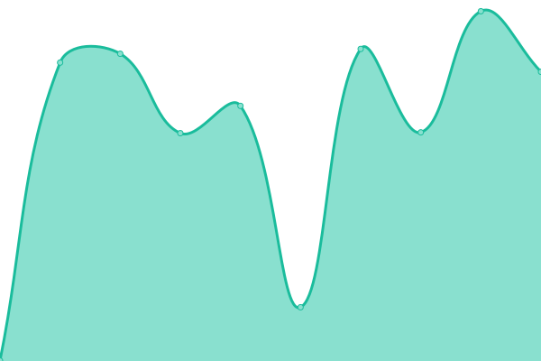

# [📈 Live Status](https://status-dev.jadyn.au): <!--live status--> **🟧 Partial outage**

This repository contains the open-source uptime monitor and status page for [Jamior](https://status-dev.jadyn.au), powered by [Upptime](https://github.com/upptime/upptime).

With [Upptime](https://upptime.js.org), you can get your own unlimited and free uptime monitor and status page, powered entirely by a GitHub repository. We use [Issues](https://github.com/Jamior/status/issues) as incident reports, [Actions](https://github.com/Jamior/status/actions) as uptime monitors, and [Pages](https://status-dev.jadyn.au) for the status page.

<!--start: status pages-->
<!-- This summary is generated by Upptime (https://github.com/upptime/upptime) -->
<!-- Do not edit this manually, your changes will be overwritten -->
<!-- prettier-ignore -->
| URL | Status | History | Response Time | Uptime |
| --- | ------ | ------- | ------------- | ------ |
|  [Homepage](https://jadyn.au) | 🟥 Down | [homepage.yml](https://github.com/Jamior/status/commits/HEAD/history/homepage.yml) | 

 274ms
     
 | 

<a href="https://status-dev.jadyn.au/history/homepage">0.63%</a>
    

|  [Portainer](https://portainer.jadyn.au) | 🟥 Down | [portainer.yml](https://github.com/Jamior/status/commits/HEAD/history/portainer.yml) | 

 107ms
     
 | 

<a href="https://status-dev.jadyn.au/history/portainer">2.70%</a>
    

|  [Gitlab](https://gitlab.jadyn.au) | 🟥 Down | [gitlab.yml](https://github.com/Jamior/status/commits/HEAD/history/gitlab.yml) | 

 76ms
     
 | 

<a href="https://status-dev.jadyn.au/history/gitlab">0.14%</a>
    

|  [Nebula](https://dashboard.jadyn.au) | 🟥 Down | [nebula.yml](https://github.com/Jamior/status/commits/HEAD/history/nebula.yml) | 

 286ms
     
 | 

<a href="https://status-dev.jadyn.au/history/nebula">0.00%</a>
    

|  [Riot](https://riot.jadyn.au) | 🟥 Down | [riot.yml](https://github.com/Jamior/status/commits/HEAD/history/riot.yml) | 

 78ms
     
 | 

<a href="https://status-dev.jadyn.au/history/riot">1.28%</a>
    

|  [Embeds](https://embed.jadyn.au) | 🟥 Down | [embeds.yml](https://github.com/Jamior/status/commits/HEAD/history/embeds.yml) | 

 192ms
     
 | 

<a href="https://status-dev.jadyn.au/history/embeds">0.00%</a>
    

|  [Lynx](https://i.jadyn.au) | 🟥 Down | [lynx.yml](https://github.com/Jamior/status/commits/HEAD/history/lynx.yml) | 

 72ms
     
 | 

<a href="https://status-dev.jadyn.au/history/lynx">1.99%</a>
    

|  [MC Server Creamy](15.235.216.42) | 🟩 Up | [mc-server-creamy.yml](https://github.com/Jamior/status/commits/HEAD/history/mc-server-creamy.yml) | 

 225ms
     
 | 

<a href="https://status-dev.jadyn.au/history/mc-server-creamy">100.00%</a>
    

<!--end: status pages-->

[**Visit our status website →**](https://status-dev.jadyn.au)

## 📄 License

- Powered by: [Upptime](https://github.com/upptime/upptime)
- Code: [MIT](./LICENSE) © [Anand Chowdhary](https://anandchowdhary.com), supported by [Pabio](https://pabio.com)
- Data in the `./history` directory: [Open Database License](https://opendatacommons.org/licenses/odbl/1-0/)
